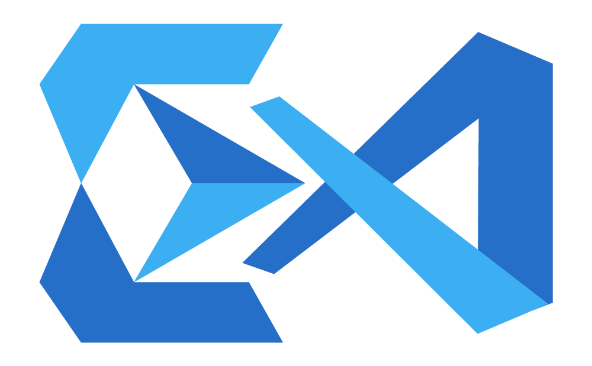
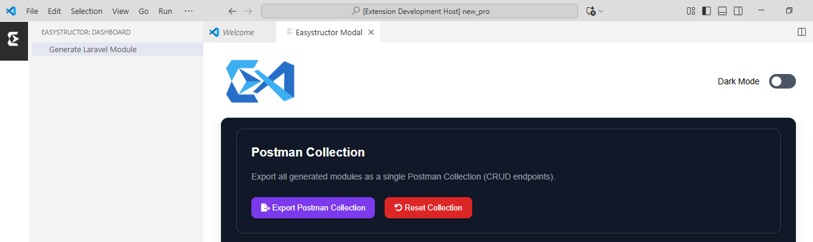
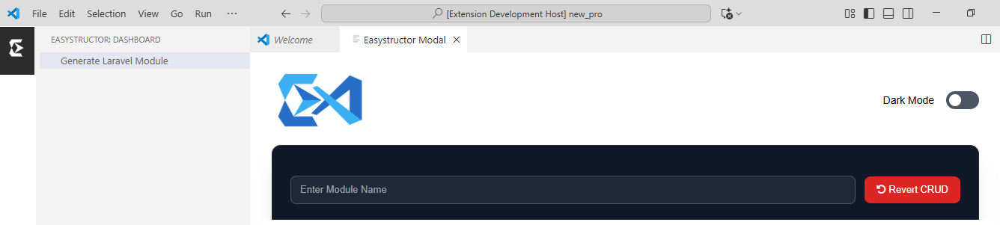

[](https://github.com/owaissaleemjokhio/easystructor/blob/master/LICENSE.md) [](https://marketplace.visualstudio.com/items?itemName=Easystructor.easystructor)


<h1 align="center">Easystructor - The Ultimate Developer Toolkit for VS Code</h1>

<div align="center">
    
</div>

**Easystructor** is a powerful **VS Code Extension** that provides a complete, end-to-end toolkit for Laravel developers.  
It streamlines the entire workflow with **automated code generation, database schema design, real-time previews, API testing, Git workflow automation, and integrated task management** — all within a modern **Webview interface**.  

Unlike traditional generators, **Easystructor** goes beyond scaffolding by unifying the entire development lifecycle — from **idea to implementation, API integration, version control, and project management** — directly inside VS Code, making it a true productivity companion for modern teams.  

> 💡 From idea → Code → API → Git → Project Management — everything inside VS Code.

---
## ✨ Core Productivity Features

- 📋 **Kanban Board**  
  A built-in **project management board** inside VS Code:  
  - Add, edit, delete tasks & columns  
  - Drag-and-drop tasks between columns  
  - Export/Import JSON for backups or sharing  

- 🔀 **Auto Git Workflow**  
  Easystructor handles versioning for you:  
  - Creates a new branch (`feature/module-name`)  
  - Runs `git add .`  
  - Commits (`feat: Added ModuleName CRUD`)  
  - Pushes to remote automatically 

- 📦 **Postman Exporter**  
  Generate a **ready-to-use Postman Collection** with all your CRUD endpoints in one click.  

- ⚡ **Real-time Stub Preview**  
  Instantly preview Models, Controllers, Services, Requests, and Resources before they are written to your Laravel project.  

- 🛠️ **Migration Builder**  
  Add fields via an interactive form and see a **live migration code preview** for faster schema design.  

- 🗑️ **Safe Revert Actions**  
  Roll back entire CRUD modules safely without leaving leftover files or half-deleted code.  

- 📂 **Config Import/Export**  
  Save your extension setup (board state, CRUD settings, preferences) as JSON and reload anytime.  

- 🧩 **Multiple Modals**  
  Smooth and modern dialogs for CRUD, tasks, confirmations, and detail previews.  

- 🌗 **Dark Mode Support**  
  Toggle between dark and light themes seamlessly.  

---

## ✅ Laravel Integration Features

- 🔧 **Complete CRUD Modules**:  
  - 🧩 **Model** (with `$fillable`, `$attributes`, casting & relationships)  
  - 🛡️ **Form Request** (accurate validation rules)  
  - ⚙️ **Controller** (Service + Resource pattern)  
  - 📦 **Service Class** (filters, pagination, CRUD methods)  
  - 🎯 **Resource Class** (standardized JSON responses)  
- ⚙️ Auto-registers routes via `Route::apiResource(...)`  
- 🔁 Centralized **JSON Response & Exception Handling**  
- 🔍 Smart service filters (text-based `LIKE` vs exact match)  
- 🧪 Supported field types:  
  `string`, `text`, `integer`, `bigint`, `float`, `decimal`,  
  `boolean`, `enum`, `date`, `datetime`, `time`, `json`  

---

## 🧾 Output Examples

### Migration
```php
$table->string('name');
$table->string('email')->nullable();
$table->decimal('price', 10, 2)->default(0.00);
$table->boolean('is_active')->default(true);
$table->enum('role', ['admin', 'user'])->default('user');
$table->dateTime('registered_at')->nullable();
```

### 🧾 Output: Validation Rules

```php
'name' => 'required|string',
'email' => 'nullable|string',
'price' => 'required|numeric',
'is_active' => 'required|boolean',
'role' => 'required|in:admin,user',
'registered_at' => 'nullable|date',
```

### 🧾 Output: Service Filters

```php
->when(isset($filters['name']), fn($q) => $q->where('name', 'like', '%' . $filters['name'] . '%'))
->when(isset($filters['price']), fn($q) => $q->where('price', $filters['price']))
->when(isset($filters['is_active']), fn($q) => $q->where('is_active', $filters['is_active']))
```

## 📁 Output Structure

```
app/
├── Models/Product.php
├── Http/
│   ├── Controllers/ProductController.php
│   ├── Requests/ProductRequest.php
│   ├── Resources/ProductResource.php
├── Services/ProductService.php
routes/
└── api.php (auto-updated)
```
---

## 🚀 Getting Started

## 📦 Installation

Install **Easystructor** from the [Visual Studio Code Marketplace](https://marketplace.visualstudio.com/items?itemName=Easystructor.easystructor):

```bash
code --install-extension Easystructor.easystructor
```

---

## 💻 Usage

1. Open the **Easystructor Sidebar** inside VS Code.  
2. Organize and track progress using the built-in **Kanban Board**. 
3. Use the **Migration Builder** to design your database schema with a live preview.  
4. Instantly **preview code stubs** before finalizing.  
5. Generate a **Laravel module** (Models, Controllers, Services, Requests, Resources) in one click.  
6. Commit your changes with **Auto Git Workflow** (branch → add → commit → push).  
7. Export all endpoints as a **Postman Collection** for quick API testing.  

---

## 📸 Workflow in Action

Export endpoints to **Postman**  

---
Easily **Revert a Module**  

<!-- ---
Design database with **Migration Builder**  

---
Preview code with **Stub Preview**  
 -->


---

## 🛣️ Roadmap

- [x] Kanban Board (task management with drag & drop, import/export)  
- [x] Auto Git Workflow (branch → add → commit → push)  
- [x] Postman Collection Exporter  
- [x] Real-time Stub Preview (Model, Controller, Service, Request)  
- [x] Laravel CRUD Generator  
- [x] Migration Builder with live preview  
- [x] Config Import/Export (CRUD configs, board settings, preferences)  
- [x] Safe Revert CRUD modules  
- [x] Centralized JSON Response handling  
- [x] Dark/Light mode support  
- [ ] Relationships generator (belongsTo, hasMany, etc.) 
- [ ] Custom validation rules 
- [ ] Seeder & Factory stubs
- [ ] AI-assisted module suggestions
- [ ] Swagger/OpenAPI generator for API docs  
- [ ] Advanced GitOps (auto PRs, semantic release hooks)  

---

### License
This Easystructor package is open-source software licensed under the MIT License. See the [LICENSE](https://github.com/owaissaleemjokhio/easystructor/blob/master/LICENSE.md) file for more information.

### Contributions and Feedback
Contributions, issues, and feedback are welcome! If you encounter any problems or have suggestions for improvements, please feel free to create an issue on  [GitHub](https://github.com/owaissaleemjokhio/easystructor)


Thank you for using Easystructor to simplify your full-stack development workflow. We hope this extension speeds up your project scaffolding and helps you write clean, structured code effortlessly. If you have any questions or need support, don’t hesitate to reach out. Happy coding! 💻🚀